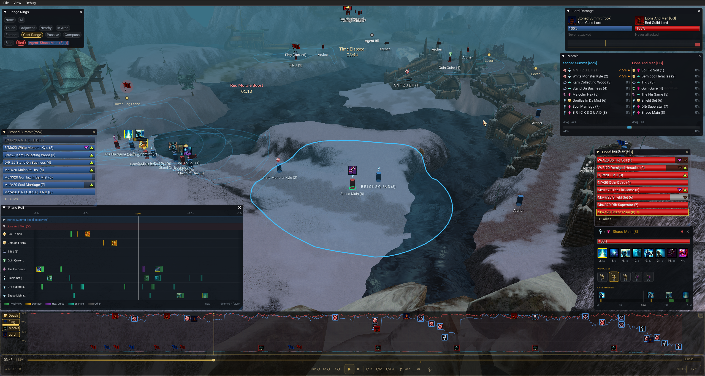
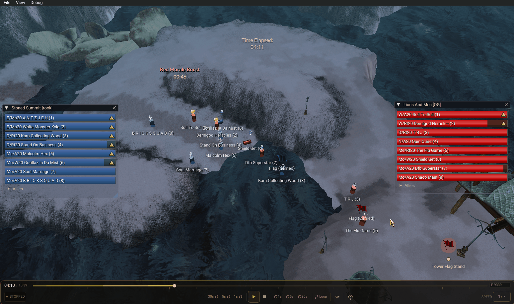
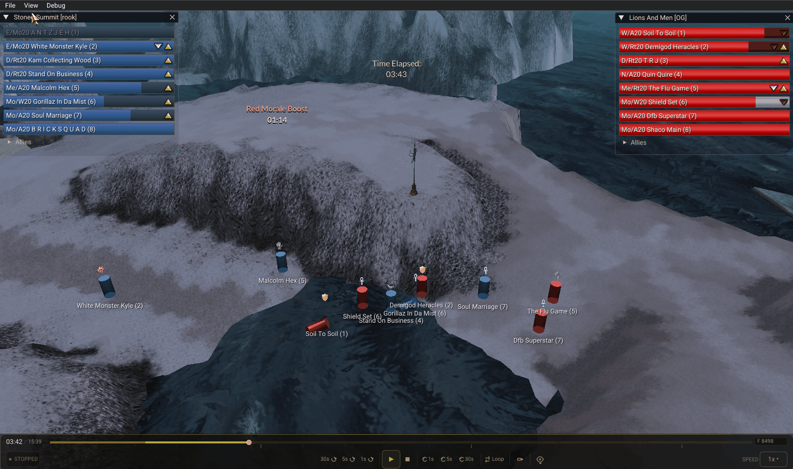
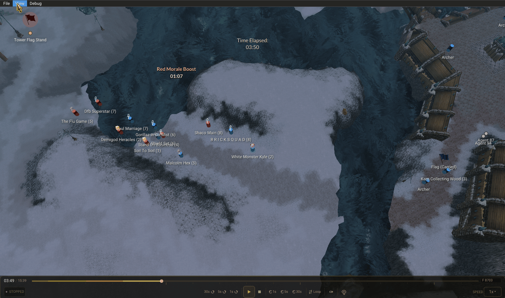
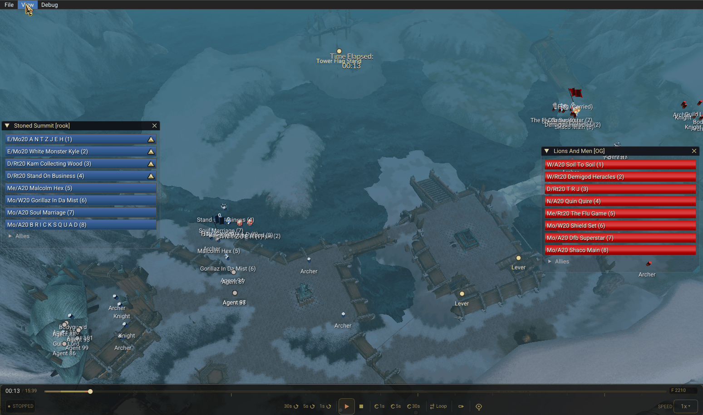
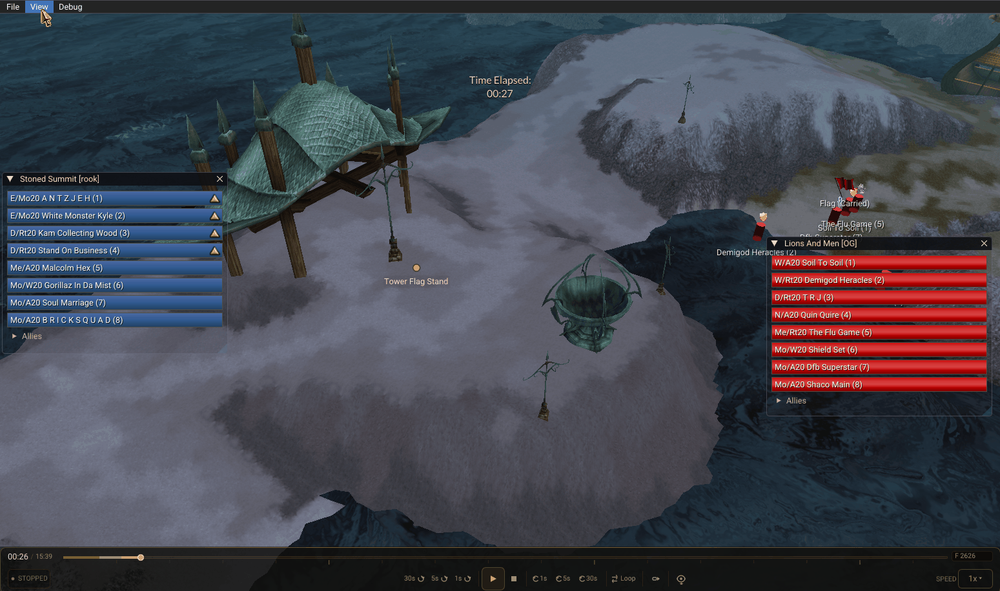

# GW Observer

Join the dedicated Discord : https://discord.gg/qAe2QmmKK4

**GW Observer** is a Guild Wars 1 GvG match replay and analysis tool. Load recorded matches, replay them in a 3D map view, and analyse team performance with a suite of tactical overlays and metrics.

Match data is provided by [Tolkano.com](https://tolkano.com) — the leading Guild Wars 1 GvG match archive.

> **GW Observer is a closed-source community tool.** See [LICENCE.md](LICENCE.md) for terms of use.

---

---

## Features

---

### 3D Match Replay

Watch GvG matches replay in full 3D using your local Guild Wars map geometry. Scrub through any moment, control playback speed, and observe every player's movement and position in real time.

- Scrubable timeline with variable playback speed (0.25× to 5×)
- Agent cylinders with blue and red team color coding
- NPC, pet, and Guild Lord size distinction
- Knockdown state represented by tipped cylinder

---

### Skill Icons & Cast Indicators

Every skill cast is visualized directly on the agent in the 3D scene. Cast bars appear below the skill icon and animate in real time.

- Skill icons displayed above each agent as billboards
- Cast bar fills left to right over cast duration
- Color coded status: cast successful (green), cast cancelled (yellow), cast interrupted (purple)
- Laser lines from caster to target during cast

---

### Range Rings

Display configurable range rings around any agent. Rings conform to the terrain surface — they follow slopes and elevation changes exactly.

- 8 range types: Touch, Adjacent, Nearby, In Area, Earshot, Cast Range, Passive Spirit, Compass
- Toggle rings per type, per team, or per player
- Click any agent or party panel row to isolate their rings
- Filled rings with 15% fill opacity, full edge

---

### Fog of War

Replay matches from the perspective of one team or one specific player. Terrain outside vision range is desaturated and darkened.

- Team perspective: union of all 8 players' compass ranges
- Single player perspective: click any player to see only what they could see
- Ghost mode: show hidden enemies at 30% opacity
- Vision collapses to zero when selected player dies

---

### Morale & Event Timeline

Track team morale and death penalty in real time. The event timeline shows both teams' health curves across the full match with major events marked.

- Per-player death penalty tracking (-15% to -60%)
- Death Pact immunity and grace period rules
- Morale boost detection and instant recharge
- Team health curves with death, flag, and lord event markers
- Click any event marker to jump to that timestamp

---

### Auto Camera

Intelligent camera system that focuses on the most analytically important moment at any given time — without manual control.

- Prioritizes imminent deaths and forming spikes
- Tracks flag carriers during flag runs
- Focuses on Guild Lord when under attack
- Configurable lookahead window and HP threshold
- Minimum dwell time prevents camera jitter
- Debug overlay shows scoring for all agents

---

### Piano Roll

See all 16 players' skill activity on a single shared time axis. Instantly spot coordinated spikes, monk coverage gaps, and fight patterns.

- One row per player, grouped by team
- Color coded bars: heal/prot, damage, hex/curse
- Fixed NOW line with past left, future right
- Mouse wheel to zoom in/out (±5s to ±60s window)
- Collapse teams to reduce visual noise
- Hover any bar for skill name and timestamp
- Click any bar to jump to that moment

---

### Player Info Panel

Click any agent or party panel row to open a detailed panel for that player.

- HP, death penalty bars
- Full build with skill icons, cast counts, and recharge overlay animation
- Weapon set detection
- Active cast bar with moving skill icon
- Cast timeline
- Hover cast counter for target breakdown tooltip

---

## Getting Started

### Requirements

- Windows 10 or later
- DirectX 11 capable GPU
- A valid Guild Wars installation (`Gw.dat` required)

### Installation

1. Download the latest release from the [Releases](../../releases) page
2. Run `GWObserver.exe`
3. On first launch, accept the licence agreement
4. Point GW Observer to your `Gw.dat` file
5. Set your match data folder
6. Load a match from the match browser

> **Note:** GW Observer cannot share the DAT file with a running Guild Wars instance. To run both simultaneously, copy your Guild Wars folder to a second location and point GW Observer to the copy.

---

## Match Data

Match data is provided by [Tolkano.com](https://tolkano.com) under a data sharing agreement.

Data displayed in GW Observer is for personal viewing only and may not be extracted, stored, or redistributed. See [LICENCE.md](LICENCE.md) for full terms.

---

## Licence

GW Observer is released under the [GW Observer Community Licence v1.0](LICENCE.md).

This software is based in part on [GuildWarsMapBrowser](https://github.com/Jonathan-Greve/GuildWarsMapBrowser) by Jonathan Bjørn Greve, used under the MIT Licence. See [NOTICE.md](NOTICE.md) for full attribution.

---

## Disclaimer

Guild Wars is a registered trademark of NCSoft Corporation. GW Observer is an unofficial fan tool and is not affiliated with NCSoft or ArenaNet.
